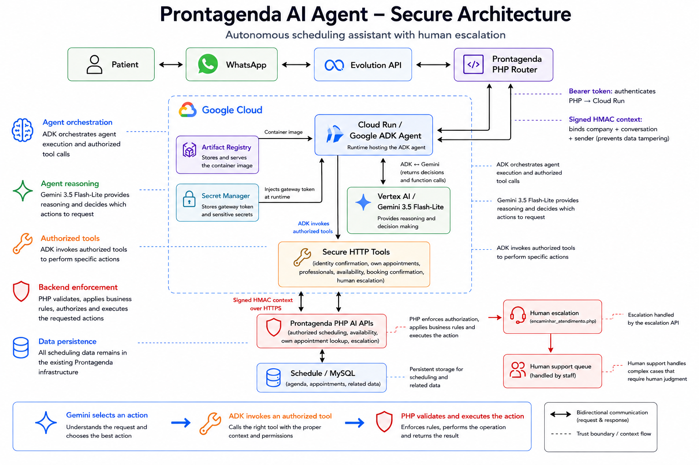

<div align="center">

# Prontagenda AI Agent

### Autonomous healthcare scheduling workflows powered by Gemini and Google Cloud

**All Things Agentic Hackathon 2026 · Taskmaster track**

[Prontagenda](https://www.prontagenda.com.br) · [Português](README.pt-BR.md)

</div>

## What it is

Prontagenda AI Agent adds a controlled agentic layer to an existing clinic
management platform. A patient can use natural language over WhatsApp to ask
about professionals and real availability, refine scheduling preferences,
confirm a booking, or request human assistance.

This is not a text-only chatbot. Gemini selects an appropriate action, Google
ADK invokes an authorized tool, and the Prontagenda backend validates and
records the result.

## Architecture



```text
Patient <-> WhatsApp <-> Evolution API <-> Prontagenda PHP router
                                              |
                                  Bearer token + signed context
                                              v
                              Cloud Run / Google ADK agent
                                              |
                                    Vertex AI / Gemini
                                              |
                                     authorized tools
                                              v
                               Prontagenda PHP AI APIs
                                              |
                                 business rules + MySQL

Unsafe, ambiguous or unsupported request -> human support queue
```

The model has no database credentials and does not choose `company_id`,
`patient_id` or the sender phone number. Identity and authorization remain in
the trusted PHP backend. See [SECURITY.md](SECURITY.md).

## Google technologies

- Google Agent Development Kit (ADK)
- Vertex AI
- Gemini 3.5 Flash-Lite
- Cloud Run
- Cloud Build
- Artifact Registry
- Secret Manager

## Repository map

```text
ai-agent/                       ADK agents, secure tools, gateway and tests
hackathon/all-things-agentic/  Docker, Cloud Build and Cloud Run deployment
integration/php/               Reviewable PHP trust-boundary implementation
docs/assets/                    Public presentation assets
```

The proprietary Prontagenda application core and all production/patient data
remain private. `integration/php/` is a reviewable extraction, not a standalone
copy of the full product.

## Run the automated tests

Requirements: Python 3.11 or newer.

```bash
cd ai-agent
python -m venv .venv
```

Activate the virtual environment, then run:

```bash
python -m pip install -r requirements.txt
python -m unittest discover -s tests -v
```

The tests use synthetic values and do not require patient data.

## Run the container locally

Requirements: Docker Desktop.

From the repository root:

```bash
docker build -f hackathon/all-things-agentic/Dockerfile -t prontagenda-hackathon .
```

Copy `hackathon/all-things-agentic/cloudrun.env.example` to a local file named
`local.env`, use test-only values, and run:

```bash
docker run --rm -p 8080:8080 --env-file local.env prontagenda-hackathon
```

Health check:

```bash
curl http://localhost:8080/health
```

The authenticated endpoint is `POST /v1/whatsapp/respond`. It requires a
Bearer token of at least 32 characters and a valid short-lived signed context
issued by the Prontagenda backend.

## Deploy to Google Cloud

The reproducible deployment files are in
[`hackathon/all-things-agentic`](hackathon/all-things-agentic/README.md).
After authenticating the Google Cloud CLI and selecting your own project:

```powershell
.\hackathon\all-things-agentic\deploy-cloud-run.ps1
```

The command above only displays the resolved configuration. Deployment occurs
only when `-Deploy` is explicitly added. Store real tokens in Secret Manager;
never commit them.

## Example workflow

1. The patient asks for an appointment after 5 PM.
2. Gemini identifies the scheduling intent and missing information.
3. ADK calls tools for professionals, working hours and live availability.
4. The backend binds every query to the signed sender context.
5. The patient chooses a valid slot and explicitly confirms.
6. PHP revalidates authorization and availability before committing.
7. The appointment appears in Prontagenda, or the case is escalated safely.

## Evidence and documentation

- [Agent implementation and tool documentation](ai-agent/README.md)
- [Cloud deployment guide](hackathon/all-things-agentic/README.md)
- [Deployment evidence](hackathon/all-things-agentic/DEPLOYMENT_EVIDENCE.md)
- [PHP integration reference](integration/php/README.md)
- [Security model](SECURITY.md)

## Author and license

Monica Simões Coelho — dentist and software developer.

This repository is shared for hackathon evaluation and portfolio purposes.
Prontagenda remains proprietary software. See [License](License).
